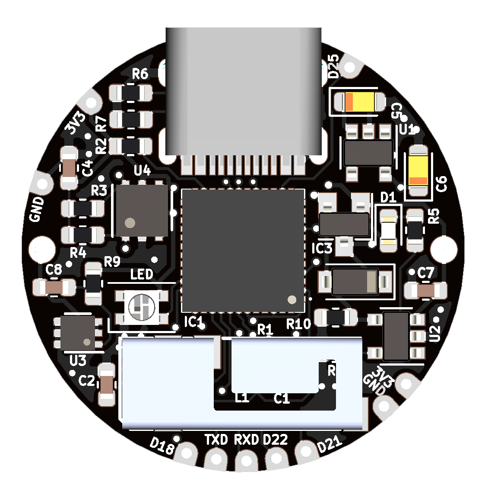

# ESPesh

ESPesh is a super tiny board designed for IoT applications.
My plan is to use it as a BLE Mesh for IoT sensors and switches, because with BLE the power consumption is less than 1mA.

# Features

  - ESP32-PICO-D4
  - Low power design (LDO, removed unnecessary components)
  - Only one inch PCB
  - USB C (only for power, not programming)
  - LiPO battery (with charger and voltage protections)
  - Some GPIOs exposed (I2C included)

### BOM

I mainly use JLCPCB and LCSC for PCB and components.

| Component | Quantity | Link | Price |
| ------ | ------ | ------ | ------ |
| ESP32-PICO-D4 | 1 | https://lcsc.com/product-detail/Others_Espressif-Systems-ESP32-PICO-D4_C193707.html | $4.34 |
| PRO-OB-440 | 1 | https://www.digikey.es/product-detail/es/proant-ab/PRO-OB-440/1532-1001-1-ND/4895684 | $0.95 |
| LIR2450 | 1 | https://es.aliexpress.com/item/32853897751.html | $2.76 |
| 0.1uF | 3 | https://lcsc.com/product-detail/Multilayer-Ceramic-Capacitors-MLCC-SMD-SMT_SAMSUNG_CL10B104KA8NNNC_100nF-104-10-25V_C1590.html | $0.29 |
| 2.7pF | 1 | https://lcsc.com/product-detail/Multilayer-Ceramic-Capacitors-MLCC-SMD-SMT_SAMSUNG_CL10C2R7CB8NNNC_2-7pF-2R7-0-25pF-50V_C16149.html | $0.61 |
| 4.7pF | 1 | https://lcsc.com/product-detail/Multilayer-Ceramic-Capacitors-MLCC-SMD-SMT_SAMSUNG_CL10C4R7CB8NNNC_4-7pF-4R7-0-25pF-50V_C57140.html | $0.405 |
| 10uF Tantalum | 2 | https://lcsc.com/product-detail/Tantalum-Capacitors_AVX_TAJA106K010RNJ_10uF-106-10-10V_C7177.html | $0.2386 |
| 10uF | 1 | https://lcsc.com/product-detail/Multilayer-Ceramic-Capacitors-MLCC-SMD-SMT_SAMSUNG_CL10A106KP8NNNC_10uF-106-10-10V_C19702.html | $0.52 |
| LED 0603 | 1 | https://lcsc.com/product-detail/Light-Emitting-Diodes-LED_Red-LED-SMDLED-80-100mcd_C84263.html | $0.64 |
| SK6805 | 1 | https://es.aliexpress.com/item/32903030496.html | $3.23 |
| MBR0520 | 1 | https://lcsc.com/product-detail/Schottky-Barrier-Diodes-SBD_Changjiang-Electronics-Tech-CJ-MBR0520_C77335.html | $0.56 |
| FDN340P | 1 | https://lcsc.com/product-detail/MOSFET_ON-Semicon_FDN340P_ON-Semicon-ON-FDN340P_C75469.html | $0.1241 |
| 1.6nH | 1 | https://lcsc.com/product-detail/Others_GOOGLL-GGW0603UC1N6KGT_C343064.html | $0.0310 |
| 10K | 2 | https://lcsc.com/product-detail/Chip-Resistor-Surface-Mount_Uniroyal-Elec-0603WAF1002T5E_C25804.html | $0.1 |
| 6.8K | 2 | https://lcsc.com/product-detail/Chip-Resistor-Surface-Mount_Uniroyal-Elec-0603WAF6801T5E_C23212.html | $0.1 |
| 2K | 1 | https://lcsc.com/product-detail/Chip-Resistor-Surface-Mount_Uniroyal-Elec-0603WAF2001T5E_C22975.html | $0.1 |
| 5K1 | 2 | https://lcsc.com/product-detail/Chip-Resistor-Surface-Mount_Uniroyal-Elec-0603WAF5101T5E_C23186.html | $0.1 |
| 43K | 1 | https://lcsc.com/product-detail/Chip-Resistor-Surface-Mount_Uniroyal-Elec-0603WAF4302T5E_C23172.html | $0.11 |
| 100R | 1 | https://lcsc.com/product-detail/Chip-Resistor-Surface-Mount_Uniroyal-Elec-0603WAF1000T5E_C22775.html | $0.11 |
| 100K | 1 | https://lcsc.com/product-detail/Chip-Resistor-Surface-Mount_Uniroyal-Elec-0603WAF1003T5E_C25803.html | $0.1 |
| SPX3819M5-L-3-3 | 1 | https://lcsc.com/product-detail/Low-Dropout-Regulators-LDO_EXAR_SPX3819M5-L-3-3-TR_SPX3819M5-L-3-3-TR_C9055.html | $0.1225 |
| SL4054ST25P | 1 | https://lcsc.com/product-detail/Others_TECHFUSE-SL4054ST25P_C258510.html | $0.509 |
| XB6566H0 | 1 | https://lcsc.com/product-detail/Others_XB6566H0_C190847.html | $0.1734 |
| HDC1080 | 1 | https://lcsc.com/product-detail/Humidity-Moisture-Sensors_TI_HDC1080DMBR_HDC1080DMBR_C82227.html | $1.1216 |
| HRO-TYPE-C-31-M-12 | 1 | https://lcsc.com/product-detail/USB-Type-C_Korean-Hroparts-Elec-TYPE-C-31-M-12_C165948.html | $0.3882 |
| | | **TOTAL** | **$17.7334**|

Take in account that some components must be ordered in larger batches that the quantity needed (for example: SK6805: we need only one, but min order is 10).

### Todos

 - Wiki
 - Test the board
 - Sell it on Tindie so I can keep developing such tiny boards

### License

GNU Public License 3.0
Please, if you pretend to use it for comercial uses, contact me before

**Free Software, Hell Yeah!**
